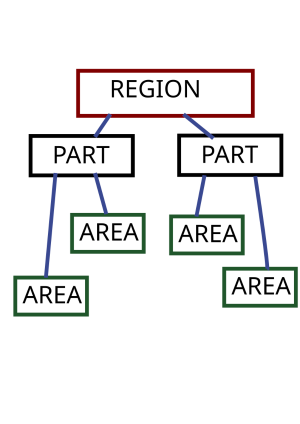

# :electric_plug:KPLC-OUTAGE-PARSER:electric_plug:


## Purpose: 

Turn KPLC outage reports from **pdfs** from [link](https://kplc.co.ke/category/view/50/planned-power-interruptions) that to **json** consumable output.

### Main strategy:

We use **pdftotxt** from the [popper-utils](http://packages.ubuntu.com/poppler-utils) of which should available on just about every linux distro, we use the `-layout` flag to make it keep the layout and it spits out a txt file very similar to the pdf even in terms of layout making it easier to parse. Then all we do next is parse the txt file next.

Bellow is an image showing the structure of the final Items on a per region view. The overall structure is a collection of Regions.



### Usage:

```rust
async{
	let link = "https://www.kplc.co.ke/img/full/Interruptions%20-%2026.01.2023.pdf";
    println!("Parsing data from {link}");
    let mut client = KPLCClient::new();
    let kplcdata_obj = client.parse_from_web(link).await.unwrap();
    println!("Data: {:?}",kplcdata_obj);    
}    

```

link is a `&str` that is passed to the client `parse_from_web` that runs in async and downloads the pdf, transforms it to a txt format use `pdftotxt` , it later then produces a `KPLCData` struct that has the structure as the image above.


## CONTRIBUTIONS:

Contributions are welcome, as this is an opensource project. It can be anything, from spelling mistakes to code performance improvements, issues are welcome too.

### Tests:

Runt `cargo test` and all tests should pass before sending a PR. Also for bonus testing, try see if the examples all run

to completion.
